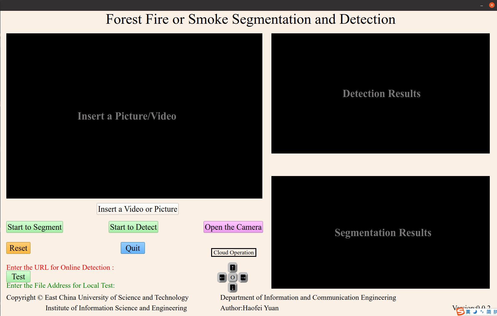

## This is a forest fire and smoke detection and fire segmentation system which is based on the yolov5 and unet. 

If you want to train your own yolov5 model, please click [here](https://github.com/ultralytics/yolov5) to learn more details. 

If you want to train your own unet model, please click [here](U-Net/readme.md) to learn more details. 

## Environment
Test on the ubuntu 20.04
```markdown
torch = '1.7.1+cu110'
torchvision = '0.8.2+cu110'
```


## Installation
```markdown
git clone https://github.com/bobo12391/Forest-Fire-and-Smoke-Detecton-and-Fire-Segmentation-GUI-design.git
```

## Pre-trained model
link: https://pan.baidu.com/s/1vhItuWMZ9gC_mvUTPGHzew  code: h2wf

You can put it in the root directory.

## Quick Start
```markdown
cd forest _fire_and_smoke_detection_and_fire_segmentation_system
python gui2.py
```
## GUI Interface




### Fire Fire and Smoke Image Detection(You can also select a video to detect)

[detect](detect.png)


### Fire Image Segmentation

[segmentation](segmentation.png)


### Camera Demo

[camera](camera.png)

## contact information
If you have any questions, please contact with me by email:15108513361@163.com
